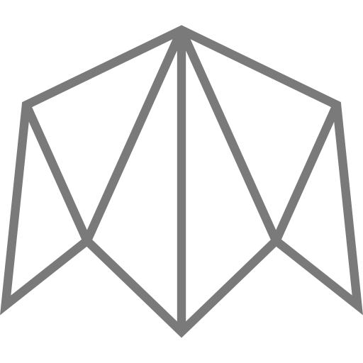

<div style="background: linear-gradient(
10deg, whitesmoke, #fefefe)">

</div>

# Booster-Finance (BETA) - Frontend

<div style="border: 1px solid red; padding: 15px 20px; margin: 30px 0;border-radius: 5px;">
    <h3>Beta Warning</h3>
    <p>This project was created for a hackathon and is not intended for use in production! The contracts are not tested sufficiently to guarantee a safe environment for real investments!</p>
    <p>We suggest the use on Testnet only!</p>
</div>

This repository is the frontend of Booster Finance. A kickstarter-like decentralized project, currently configured to run on the Harmony testnet.

It allows anyone in the world to create a project they want funding for, like kickstarter, where they can look for backers and reward their backers by using NFTs. We believe that by using NFTs, project creators can get very creative with the type of rewards and things that they offer on chain for supporters and backers.


### Deployed version
To test this app, go to https://booster-finance.web.app

## Project setup
```
yarn install
# or
npm install
```

## Development

When in a development environment, run the vue app with the following. It'll be served on http://localhost:8080/

```
npm run serve install
```

## Build

A static site can be built using:

```
npm run build install
```

## Network configuration

The available networks are configured inside: src/model/Network.ts

## Deploy New Factory

With the website running you can deploy a new factory easily by visiting the path <your-application>/setup.
